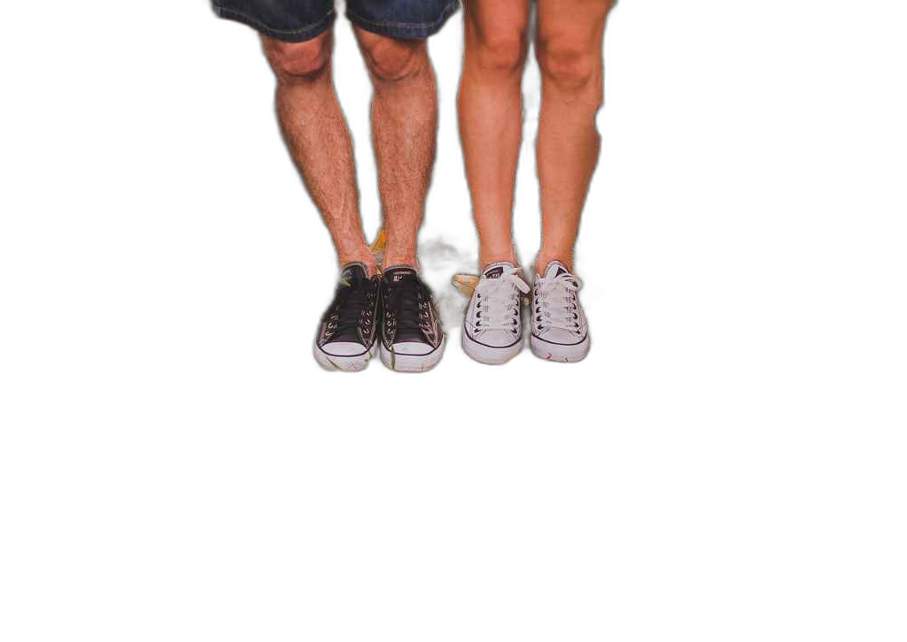

# Background Remover com RemBG

Este projeto demonstra a aplicação da biblioteca RemBG em Python para a remoção automática de fundo de imagens. O objetivo foi explorar a eficácia do rembg em diferentes cenários visuais, avaliando seu desempenho e limitações em situações reais de contraste, cor e complexidade de fundo.

## Objetivo

Desenvolver uma aplicação em Python que demonstre a capacidade do rembg na remoção de fundo de imagens, permitindo:

- Carregar uma imagem de entrada.
- Aplicar a função de remoção de fundo do rembg.
- Salvar a imagem resultante com fundo transparente (formato PNG).

## Ferramentas Utilizadas

- **Python 3.11**
- **RemBEG**: Biblioteca Python para remoção automática de fundo.
- **PIL (Pillow)**: Essencial para manipulação de imagens, especialmente para aplicar a transparência (canal RGBA) no resultado final.

## Como usar

1. Instale os requisitos:

   ```bash
   pip install -r requirements.txt
   ```

2. Execute o script principal:

   ```bash
   python main.py
   ```

3. Os resultados processados, com o fundo removido e transparência aplicada, serão salvos na pasta treated_images/.

## Análise Experimental

Para testar o comportamento do rembg, selecionei 4 imagens cuidadosamente, com diferentes características de iluminação, contraste e complexidade de fundo:

1. **Imagem 1 — Arara colorida com fundo desfocado e claro**
   <div>
      
      
   <div>
   Resultado: Excelente. A biblioteca conseguiu contornar com precisão as cores vibrantes da arara e removeu completamente o fundo. Foi a melhor performance entre os testes. Há uma clara distinção cromática. As cores da arara são muito diferentes das cores predominantes no fundo, o que permite que os algoritmos de segmentação de imagem (baseados em cor e intensidade de pixel) identifiquem facilmente os limites do objeto.

2. **Imagem 2 — Casal com roupas em tons pastéis, fundo claro e planta ao lado**
   <div>
      
      
   <div>
   Resultado: Mediando. A remoção foi majoritariamente bem-sucedida, especialmente onde havia contraste cromático sólido (e.g., a cor da blusa do homem vs. o fundo). No entanto, em áreas onde os tons de pele ou das roupas claras se aproximavam dos tons do fundo (cortinas/parede), o recorte apresentou pequenas imperfeições ou "borrões". Isso demonstra a sensibilidade dos algoritmos à similaridade de pixels em regiões de transição.

3.**Imagem 3 — Pernas com Tênis em Floresta (fundo muito detalhado)**

   <div>
      
      
   <div>
   Resultado: Fraco. A máscara gerada foi inconsistente e apresentou falhas visuais perceptíveis, com partes do fundo sendo erroneamente incluídas no objeto e vice-versa. Este é o cenário mais desafiador, a baixa distinção cromática entre o objeto e o fundo, somada à alta granularidade e complexidade do fundo (texturas irregulares, múltiplos pequenos elementos), sobrecarrega o algoritmo.

4.  **Imagem 4 — Relógio de bolso antigo, fundo escuro com tons semelhantes ao objeto**
<div>
   
   
<div>
Resultado: Insatisfatório, a biblioteca demonstrou dificuldade significativa, removendo partes importantes do relógio onde a distinção de cor e luminosidade era baixa, resultando em uma imagem final "falhada" ou com buracos. Este caso ilustra o desafio imposto pela baixa distinção cromática e de luminosidade em conjunto com a alta complexidade textural tanto do objeto (ornamentos, corrente) quanto do fundo.

### Conclusões

- A biblioteca RemBG, tem **excelente desempenho com objetos bem definidos**, cores vibrantes e contraste claro com o fundo.
- Em **cenários com fundos complexos** ou **baixa distinção de cor**, a qualidade da segmentação diminui.
- A aplicação é eficaz para uso geral, mas **não substitui completamente edições manuais** em imagens mais detalhadas e desafiadoras.

Desenvolvido por **Elisiane Quadros**
[LinkedIn](https://www.linkedin.com/in/elisiane-quadros/) • © 2025

Este projeto está licenciado sob a [MIT License](LICENSE).
